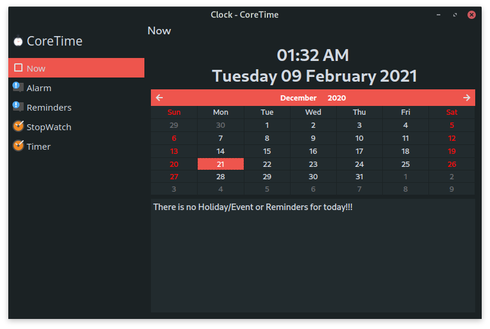

# CoreTime
A time related task manager for C Suite.

### Download
You can download latest release.
* [Source](https://gitlab.com/cubocore/coreapps/coretime/tags)
* [ArchPackages](https://gitlab.com/cubocore/wiki/tree/master/ArchPackages)
* [DebPackages](https://gitlab.com/cubocore/wiki/-/tree/master/DebPackages)
* [Gentoo](https://gitweb.gentoo.org/repo/proj/guru.git/tree/gui-apps/coretime)
* [AppImages](https://gitlab.com/cubocore/wiki/-/tree/master/AppImages)
* [Flatpak](https://flathub.org/apps/details/org.cubocore.CoreTime)

### Dependencies:
* qt5-base
* qt5-multimedia
* [libcprime](https://gitlab.com/cubocore/libcprime) 

### Information
Please see the [Wiki page](https://gitlab.com/cubocore/wiki) for this info.
* Changes in latest release ([ChangeLog](https://gitlab.com/cubocore/wiki/-/blob/master/ChangeLog))
* Build from the source ([BuildInfo](https://gitlab.com/cubocore/wiki/blob/master/BuildInfo.md))
* Tested In ([Test System](https://gitlab.com/cubocore/wiki/blob/master/TestSystem))
* Known Bugs ([Current list of issues](https://gitlab.com/groups/cubocore/coreapps/-/issues))
* Help Us

### Feedback
* We need your feedback to improve the C Suite. Send us your feedback through GitLab [issues](https://gitlab.com/groups/cubocore/coreapps/-/issues).
  
  Or feel free to join and chat with us in IRC/Matrix #cubocore:matrix.org or [Element.io](https://app.element.io/#/room/#cubocore:matrix.org)
